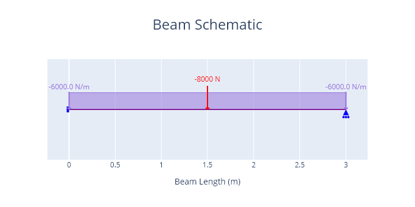
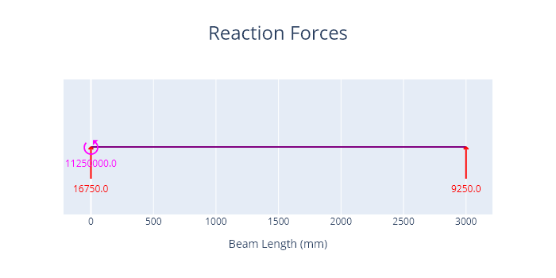
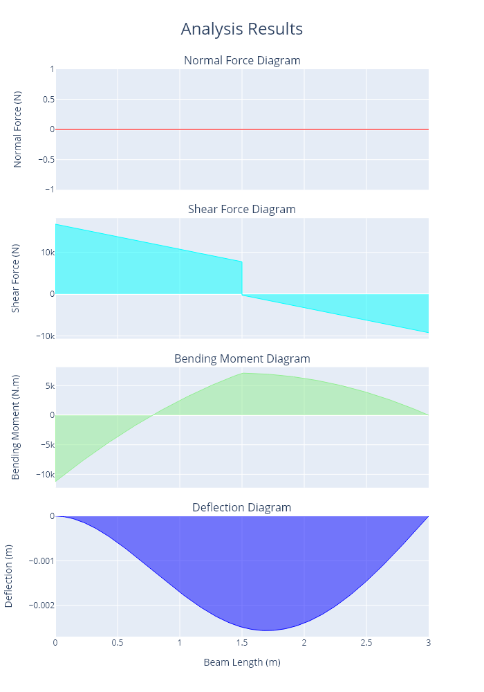

.. _example:

Indeterminate Beam with Point Load and Distributed Load
========================================================

This example demonstrates some functionality of the ``indeterminatebeam`` package. It has been taken from example 12.21 of the Hibbeler textbook :cite:`HibbelerRussell2013MoM`.

Try it in online: |colab| |binder| |website|

.. |colab| image:: https://colab.research.google.com/assets/colab-badge.svg
   :target: https://colab.research.google.com/github/JesseBonanno/IndeterminateBeam/blob/main/docs/examples/example_1.ipynb

.. |binder| image:: https://mybinder.org/badge_logo.svg
   :target: https://mybinder.org/v2/gh/JesseBonanno/IndeterminateBeam/main?filepath=docs%2Fexamples%2Fexample_1.ipynb

.. |website| image:: https://img.shields.io/website?down_color=lightgrey&down_message=offline&up_color=green&up_message=up&url=https%3A%2F%2Findeterminate-beam.herokuapp.com%2F
   :target: https://indeterminate-beam.herokuapp.com/

Specifications
--------------

A 3 m long propped cantilever AB is fixed at A (x = 0 m), and supported on a roller at B (x = 3 m).

The beam is subject to a load of 8000 N acting downwards at the midspan, and a UDL of 6000 N/m across the length of the support.

E and I are constant.

A diagram of the problem is shown below.

Results
--------

The following values can be directly extracted using the `get_shear_force`, `get_bending_moment` and `get_reaction` methods:

   #. The absolute maximum shear force 	  --> 16750 N
   #. The absolute maximum bending moment --> 11250 N.m
   #. The reaction at B         	  --> 9250 N

A plot of the reactions is shown below.

A plot of the axial force, shear force, and bending moments is shown below. A deflection graph is also presented however this depends on the beam properties E and I which werent included in this question.
As a default the values E and I are taken as the values for a 150UB18.0 steel beam. 

Code
----

.. literalinclude:: examples/example_1.py

