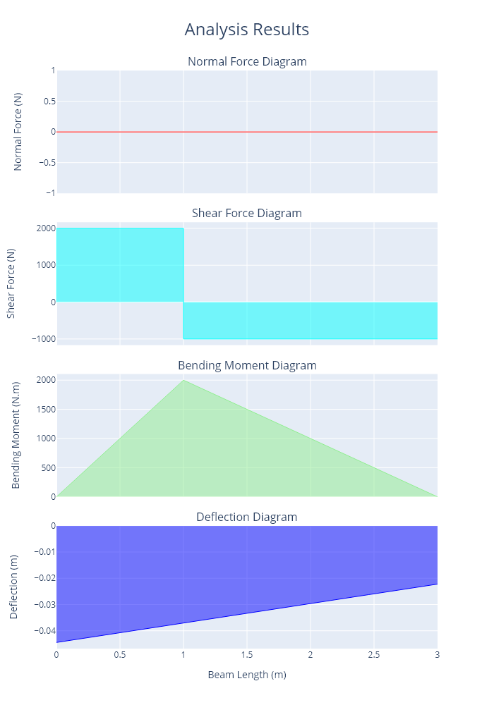

.. _examples:

1. Introduction to Examples
==============================

This section demonstrates the core functionality of the ``indeterminatebeam`` package with examples. Examples 5, 6, 7 and 8 have been taken from the Hibbeler textbook :cite:`HibbelerRussell2013MoM`.

You can follow along with examples online: |colab| |binder|

.. |colab| image:: https://colab.research.google.com/assets/colab-badge.svg
   :target: https://colab.research.google.com/github/JesseBonanno/IndeterminateBeam/blob/main/docs/examples/simple_demo.ipynb

.. |binder| image:: https://mybinder.org/badge_logo.svg
   :target: https://mybinder.org/v2/gh/JesseBonanno/IndeterminateBeam/main?filepath=docs%2Fexamples%2Fsimple_demo.ipynb

In order to effectively use the package online you should first run the cell that initialises the notebook by installing the package.

.. literalinclude:: examples/ex_1.py

You can also approach the problems using the web-based graphical user interface |website|

.. |website| image:: https://img.shields.io/website?url=https%3A%2F%2Findeterminatebeam.onrender.com
   :target: https://indeterminatebeam.onrender.com

2. Basic Usage (Readme example)
============================================================

2.1 Basic Usage
------------------------

Specifications
+++++++++++++++++++

A diagram of the problem is shown below.

Results
+++++++++++++++++++

A plot of the reactions is shown below.

A plot of the axial force, shear force, bending moments and deflections is shown below. 

Code
+++++++++++++++++++

.. literalinclude:: examples/ex_2a.py

2.2 Querying Data
------------------------

Specifications
+++++++++++++++++++

The same beam as presented in 2(a) is analysed further for specific information. Querys are set at specific coordinates to allow for more precise data, rather than a general graph over view.

Results
+++++++++++++++++++

The program outputs the following text.::
   
   bending moments at 3 m: -2144.6156464615
   shear forces at 1,2,3,4,5m points: [-2381.5384615385, 618.4617384615, 2618.4617384615, 4618.4615384615, 4618.4615384615]
   normal force absolute max: 0.0
   deflection max: 0.0041098881

A plot of the axial force, shear force, bending moments and deflections is shown below. 

Code
+++++++++++++++++++

.. literalinclude:: examples/ex_2b.py

2.3 Specifing units
------------------------

Specifications
+++++++++++++++++++

The same beam as presented in 2(a) is set up using alternative units for the same result. Note that units are used to modify both inputs and outputs. Default units are SI (N and m).

A diagram of the problem is shown below.

Results
+++++++++++++++++++

A plot of the reactions is shown below.

A plot of the axial force, shear force, bending moments and deflections is shown below. 

Code
+++++++++++++++++++

.. literalinclude:: examples/ex_2c.py

3. Support class breakdown
============================================================

Representation
----------------

Supports can be created for a range of degrees of freedom. In order to ensure all possible supports are visually distinct a seperate support represenation has been used for each different possible degree of freedom combination.

The creation of different supports is shown in the code and diagram below.

Code
----

.. literalinclude:: examples/ex_3.py

4. Load classes breakdown
============================================================

4.1 Point Torque
---------------------

Representation
+++++++++++++++++++

A beam loaded with point torques is shown below.

.. figure:: examples/ex_4a_diagram.png
  :width: 700
  :alt: ex_4a_diagram

Code
+++++++++++++++++++

.. literalinclude:: examples/ex_4a.py

4.2 Point Load
---------------------

Representation
+++++++++++++++++++

A beam loaded with point loads is shown below.

Code
+++++++++++++++++++

.. literalinclude:: examples/ex_4b.py

4.3 Uniformly Distributed Load (UDL)
---------------------------------------------

Representation
+++++++++++++++++++

A beam loaded with uniformly distributed loads is shown below.

Code
+++++++++++++++++++

.. literalinclude:: examples/ex_4c.py

4.4 Trapezoidal Load
---------------------------------------------

Representation
+++++++++++++++++++

A beam loaded with trapezoidal loads is shown below.

Code
+++++++++++++++++++

.. literalinclude:: examples/ex_4d.py

4.5 Distributed Load
---------------------------------------------

Representation
+++++++++++++++++++

A beam loaded with distributed loads is shown below.

It should be noted that distributed loads are treated differently by the program as compared to all other load objects. Distributed loads are set up to be more flexible but at the cost of the calculations running much slower. Where other functions can be used the distributed load type object should be avoided.

Code
+++++++++++++++++++

.. literalinclude:: examples/ex_4e.py

4.6 Vertical and Horizontal load child classes
------------------------------------------------

Representation
+++++++++++++++++++

For all loads except the point torque an angle is specified for the direction of the load. If the load to be specified is to be completely vertical or completely horizontal a V (vertical) or a H (horizontal) can be added at the end of the class name, and the angle does then not need to be specified.

.. figure:: examples/ex_4f_diagram.png
  :width: 700
  :alt: ex_4f_diagram

Code
+++++++++++++++++++

.. literalinclude:: examples/ex_4f.py

5. Statically Determinate Beam
============================================================

This example has been taken from Ex 12.14 in the Hibbeler textbook :cite:`HibbelerRussell2013MoM`.

Specifications
----------------

An 8 m long cantilever AB is fixed at A (x = 0 m).

The beam is subject to a trapezoidal load of magnitude 4000 N/m acting downwards at x = 0 m, linearly decreasing in magnitude to a value of 0 N/m at x = 6 m.

Determine the displacement at B (x = 8 m) as a function of EI.

A diagram of the problem is shown below.

Results
--------

The deflection is -244800.0036000013 (N.m3) / EI (N.m2)

Code
----

.. literalinclude:: examples/ex_5.py

6. Statically Indeterminate Beam
============================================================

This example has been taken from Ex 12.21 in the Hibbeler textbook :cite:`HibbelerRussell2013MoM`.

Specifications
--------------

A 3 m long propped cantilever AB is fixed at A (x = 0 m), and supported on a roller at B (x = 3 m).

The beam is subject to a load of 8000 N acting downwards at the midspan, and a UDL of 6000 N/m across the length of the support.

E and I are constant.

A diagram of the problem is shown below.

Results
--------

The following values can be directly extracted using the `get_shear_force`, `get_bending_moment` and `get_reaction` methods:

   #. The absolute maximum shear force 	  --> 16750 N
   #. The absolute maximum bending moment --> 11250 N.m
   #. The reaction at B         	  --> 9250 N

A plot of the reactions is shown below.

A plot of the axial force, shear force, and bending moments is shown below. A deflection graph is also presented however this depends on the beam properties E and I which werent included in this question.
As a default the values E and I are taken as the values for a 150UB18.0 steel beam. 

.. figure:: examples/ex_6_internal.png
  :width: 700
  :alt: ex_6_internal

Code
----

.. literalinclude:: examples/ex_6.py

7. Spring Supported Beam
============================================================

This example has been taken from Ex 12.16 in the Hibbeler textbook :cite:`HibbelerRussell2013MoM`.

Specifications
---------------

A 3 m long beam has spring supports at A (x = 0 m) and B (x = 3 m). 

Both spring supports have a stiffness of 45 kN/m. 

A downwards vertical point load of magnitude 3000 N acts at x = 1 m.

The beam has a Young's Modulus (E) of 200 GPa and a second moment of area (I) of 4.6875*10**-6 m4.

Determine the vertical displacement at x = 1 m.

A diagram of the problem is shown below.

Results
--------

The deflection is -0.0370370392 m

A plot of the reactions is shown below.

.. figure:: examples/ex_7_reactions.png
  :width: 700
  :alt: ex_7_reactions

A plot of the axial force, shear force, and bending moments is shown below. 

Code
----

.. literalinclude:: examples/ex_7.py

8. Axially Loaded Indeterminate Beam
============================================================

This example has been taken from Ex 4.13 in the Hibbeler textbook :cite:`HibbelerRussell2013MoM`.

Specifications
---------------
A rod with constant EA has a force of 60kN applied at x = 0.1 m, and the beam has fixed supports at x=0, and x =0.4 m. Determine the reaction forces.

A diagram of the problem is shown below.

Results
--------

A plot of the reactions is shown below.

The normal force diagram is presented below.

Code
----

.. literalinclude:: examples/ex_8.py
