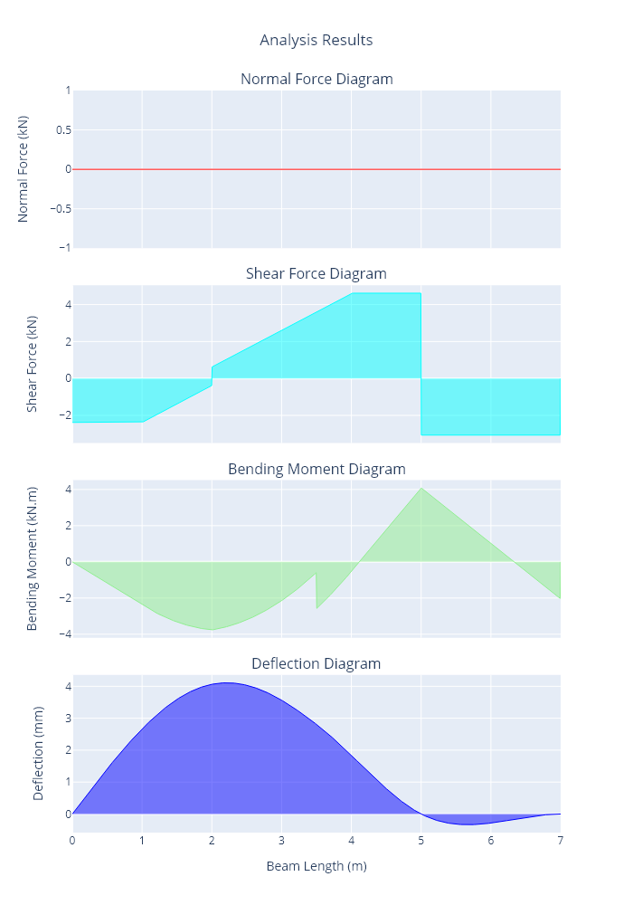

# Summary

IndeterminateBeam is a Python Package aiming to serve as a foundation for civil and structural engineering projects in Python. The module can also serve as a standalone program and is useful for determining:

  - reaction forces for indeterminate beams
  - internal forces for indeterminate beams (shear, bending, axial)
  - deflections of beams due to resulting forces
  - axial force, shear force, bending moment and deflection diagrams.

The module is based mainly on engineering concepts of statics as described in [@HibbelerRussell2013MoM], and python packages Sympy [@sympy2017] and Matplotlib [@Hunter2007]. The [package documentation](https://indeterminatebeam.readthedocs.io/en/main/) provides a brief overview of the theory behind the solutions used to calculate the forces on the indeterminate beam.

The `indeterminatebeam` package is ready for installation using `pip` or can be tested online using the provided [Jupyter notebook](https://colab.research.google.com/github/JesseBonanno/IndeterminateBeam/blob/main/docs/examples/readme_example.ipynb).


# Statement of Need

In the civil and structural engineering industry in-house software generally consists of numerous standalone excel files. Although the excel files can often be greatly valuable once created, they are often created from scratch with difficulty in making use of previous excel projects.

Python can be utilised to combat this problem, allowing for the adoption of previous work as a python module. This will allow for in-house engineering software to be more uniform, readable, manageable, and reliable.

The demand for such a calculation module in the engineering industry can be observed with the existence of many websites that perform such a calculation. Examples of such websites are included in Table 1. Most of these require payment for full access to the software and expose only a graphical user interface to the user, preventing the creation of higher order engineering python projects.

This python package was heavily inspired by [beambending](https://github.com/alfredocarella/simplebendingpractice) [@Carella2019], a module created by Alfredo Carella of the Oslo Metropolitan University for educational purposes. The beambending module, although well documented, can only solve for simply supported beams consisting of a pin and roller support. The [package documentation](https://simplebendingpractice.readthedocs.io/en/latest/?badge=latest) for this project includes a more rigorous overview of the theory behind the basics behind solving for determinate structures.

A feature comparison in Table 1 below has been taken from @Carella2019 and modified to include more packages and features.


There are five main differences between the ```indeterminatebeam``` package and the rest of the reviewed tools:

* Arbitrary distributed load functions are accepted (as long as sympy can parse them), i.e. they are not restricted to constants or linear functions.
* The package can be called from regular Python code, which makes it easy to implement higher order engineering solutions.
* It is not only free but also completely open-source.
* Spring supports can be modelled
* Any degree of freedom combination can be constructed for supports 


# Functionality and Usage

A typical use case of the `indeterminatebeam` package involves the following steps:

1. Create a `Beam` object
2. Create `Support` objects and assign to `Beam`
3. Create `load` objects and assign to `Beam`
4. Solve for forces on `Beam` object
5. Plot results

Units and load direction conventions are described in the [package documentation](https://indeterminatebeam.readthedocs.io/en/main/).

You can follow along with the example below in this [web based notebook](https://colab.research.google.com/github/JesseBonanno/IndeterminateBeam/blob/main/docs/examples/readme_example.ipynb)

##### Creating Beam

The creation of a beam instance involves the input of the beam length (m) and optionally the input of the young's modulus (E), second moment of area (I), and cross-sectional area (A). E, I and A are optional and by default are the properties of a steel 150UB18.0. For a beam with constant properties, these parameters will only affect the deflections calculated and not the distribution of forces, unless spring supports are specified.

```python
from indeterminatebeam import Beam
 # Initialize a Beam object of length 7 m with E and I as defaults
beam = Beam(7)                       
# Initialize a Beam object of length 9 m with E, I, and A assigned by user
beam_2 = Beam(9,E=2000, I =10**6, A = 3000)      
```

##### Defining Supports
Support objects are created separately from the beam object, and are defined by an x-coordinate (m) and the beams translational and rotational degrees of freedom.

Degrees of freedom are represented by a tuple of 3 booleans, representing the x , y , and m directions respectively. A `1` indicates the support is fixed in a direction and a `0` indicates it is free.

Optionally stiffness can be specified in either of the translational directions, which overrides the boolean specified.

```python
#import Support
from indeterminatebeam import Support
# Defines a pin support at location x = 5m  
a = Support(5,(1,1,0))      
# Defines a roller support at location x = 0m
b = Support(0,(0,1,0))      
# Defines a fixed support at location x = 7m
c = Support(7,(1,1,1))      
# Assign the support objects to a beam object created earlier
beam.add_supports(a,b,c)    
```
##### Defining loads
Load objects are created separately from the beam object, and are generally defined by a force value and then a coordinate value, however this varies slightly for different types of loading classes.

```python
#import load objects
from indeterminatebeam import PointLoadV, PointTorque, DistributedLoadV
# Defines a point load of 1kn acting up, at location x = 2m
load_1 = PointLoadV(1,2)                
# Defines a 2kN UDL from location x = 1m to x = 4m 
load_2 = DistributedLoadV(2,(1,4))     
 # Defines a 2kN.m point torque at location x = 3.5m
load_3 = PointTorque(2, 3.5)           
# Assign the support objects to a beam object created earlier
beam.add_loads(load_1,load_2,load_3)    
```

##### Solving for Forces
Once the beam object has been assigned with loads and supports it can be solved. To solve for reactions and internal forces we simply call the analyse function.

```python
beam.analyse()  
```

##### Plot results
After the beam has been analysed we can plot the results.

```python
beam.plot()                            
```

The `plot` method is actually a wrapper that combines these five methods: `plot_beam_diagram`, `plot_normal_force`, `plot_shear_force`, `plot_bending_moment` and `plot_deflection` into a single A4-sized printer-friendly plot.

The script above produces Figure 1 below.

{ height=750px }

# References
