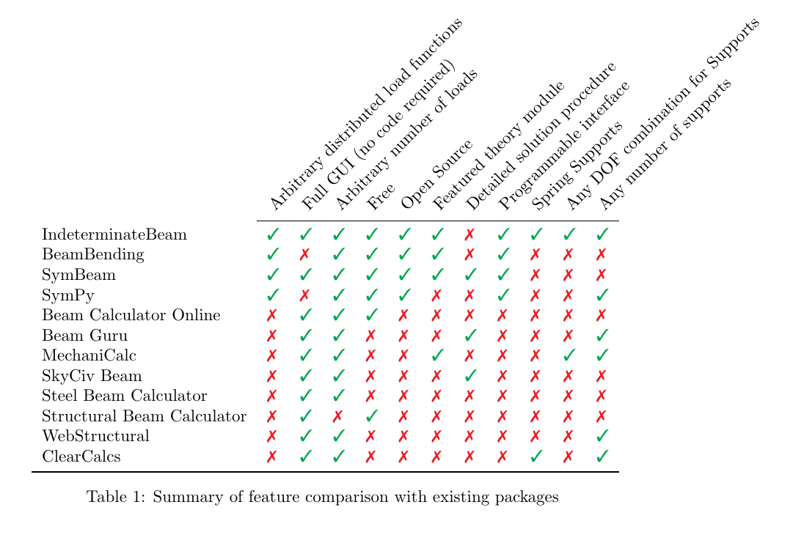

# Summary

`IndeterminateBeam` is a Python package aiming to serve as a foundation for civil and structural engineering projects in Python. The package can also serve as a standalone program and is useful for determining: 

  - reaction forces for indeterminate beams
  - internal forces for indeterminate beams (shear, bending, axial)
  - deflection of beams due to resulting forces
  - axial force, shear force, bending moment and deflection diagrams

The module is based primarily on engineering concepts of statics as described in [@HibbelerRussell2013MoM], and Python packages Sympy [@sympy2017] and Matplotlib [@Hunter2007]. The [package documentation](https://indeterminatebeam.readthedocs.io/en/main/) provides a brief overview of the theory behind the solutions used to calculate the forces on the indeterminate beam.

The package can be used by:

   - teachers who want to generate problems
   - students who want to verify solutions
   - students who want to observe the effect minor geometry changes can have on forces
   - students, teachers or engineers who want to create higher order engineering projects using this project as a starting point

The `IndeterminateBeam` [package repository](https://github.com/JesseBonanno/IndeterminateBeam) can be found on Github and is ready for installation using `pip`. A text-based example of the package can be found on this [Jupyter Notebook](https://colab.research.google.com/github/JesseBonanno/IndeterminateBeam/blob/main/docs/examples/readme_example.ipynb) and a web-based graphical user interface (GUI) is available at https://indeterminate-beam.herokuapp.com/.

# Statement of Need
Statics is fundamental to many fields of engineering such as civil, structural and mechanical engineering. This package aims to help student understanding in two ways:

1. Explain the background theory used to solve the indeterminate beam briefly in the [package documentation](https://indeterminatebeam.readthedocs.io/en/main/theory.html) 
2. Provide a software solution that allows students to recieve immediate visual feedback on changes a beam system can have on internal and external forces

This Python package was heavily inspired by [beambending](https://github.com/alfredocarella/simplebendingpractice) [@Carella2019], an educational module created by Alfredo Carella of the Oslo Metropolitan University. The beambending module, although well documented, can only solve for simply supported beams consisting of a pin and roller support. The [package documentation](https://simplebendingpractice.readthedocs.io/en/latest/?badge=latest) for this project includes a more rigorous overview of the theory behind the basics for solving determinate structures.
A feature comparison in Table 1 below has been taken from @Carella2019 and modified to include more packages and features.



There are five main differences between the ```indeterminatebeam``` package and the rest of the reviewed tools:

* Arbitrary distributed load functions are accepted
* The package can be called from regular Python code, which makes it easy to implement higher order engineering solutions
* It is free and open source
* Spring supports can be modelled
* Any degree of freedom combination can be constructed for supports 


## Functionality and Usage

A typical use case of the `IndeterminateBeam` package involves the following steps:

1. Create a `Beam` object
2. Create `Support` objects and assign to `Beam`
3. Create `Load` objects and assign to `Beam`
4. Solve for forces on `Beam` object
5. Plot results

You can follow along with the example below in this web-based [Jupyter Notebook](https://colab.research.google.com/github/JesseBonanno/IndeterminateBeam/blob/main/docs/examples/readme_example.ipynb). Units and load direction conventions are described in the [package documentation](https://indeterminatebeam.readthedocs.io/en/main/theory.html).

### Creating a Beam

The creation of a `Beam` instance involves the input of the beam length (m) and optionally the input of the Young's Modulus (E), second moment of area (I), and cross-sectional area (A). E, I and A are optional and by default are the properties of a steel 150UB18.0. For a beam with constant properties, these parameters will only affect the deflections calculated and not the distribution of forces, unless spring supports are specified.

```python
from indeterminatebeam import Beam
# Create 7 m beam with E, I, A as defaults
beam = Beam(7)                          
# Create 9 m beam with E, I, and A assigned by user
beam_2 = Beam(9,E=2000, I =10**6, A = 3000)     
```

### Defining Supports
`Support` objects are created separately from the `Beam` object, and are defined by an x-coordinate (m) and the beams translational and rotational degrees of freedom.

Degrees of freedom are represented by a tuple of 3 booleans, representing the x , y , and m directions respectively. A `1` indicates the support is fixed in a direction and a `0` indicates it is free.

Optionally, stiffness can be specified in either of the translational directions, which overrides the boolean specified.

```python
from indeterminatebeam import Support
# Defines a pin support at location x = 5m  
a = Support(5,(1,1,0))      
# Defines a roller support at location x = 0m
b = Support(0,(0,1,0))      
# Defines a fixed support at location x = 7m
c = Support(7,(1,1,1))      
# Assign the support objects to a beam object created earlier
beam.add_supports(a,b,c)    
```

### Defining loads
`Load` objects are created separately from the `Beam` object, and are generally defined by a force value and then a coordinate value, however this varies slightly for different types of loading classes.

```python
from indeterminatebeam import PointLoadV, PointTorque, DistributedLoadV
# Create 1kN point load at x = 2m
load_1 = PointLoadV(1,2)
# Create a 2kN UDL from x = 1m to x = 4m
load_2 = DistributedLoadV(2,(1,4))
# Defines a 2kN.m point torque at x = 3.5m
load_3 = PointTorque(2, 3.5)
# Assign the load objects to the beam object
beam.add_loads(load_1,load_2,load_3)
```

### Solving for Forces
Once the `Beam` object has been assigned with `Load` and `Support` objects it can then be solved. To solve for reactions and internal forces we call the analyse function.

```python
beam.analyse()  
```

### Plotting results
After the beam has been analysed we can plot the results.

```python
beam.plot_beam_external()
beam.plot_beam_internal()
```

The `plot_beam_external` and `plot_beam_internal` methods collate otherwise seperate plots.

The script above produces the following figures:


# References
